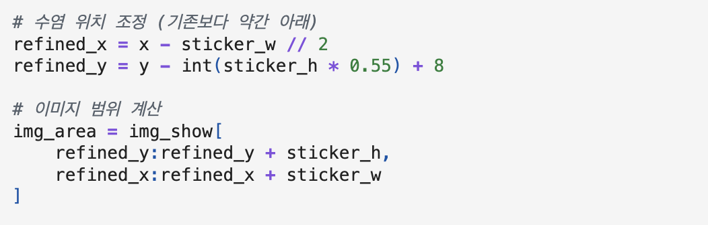
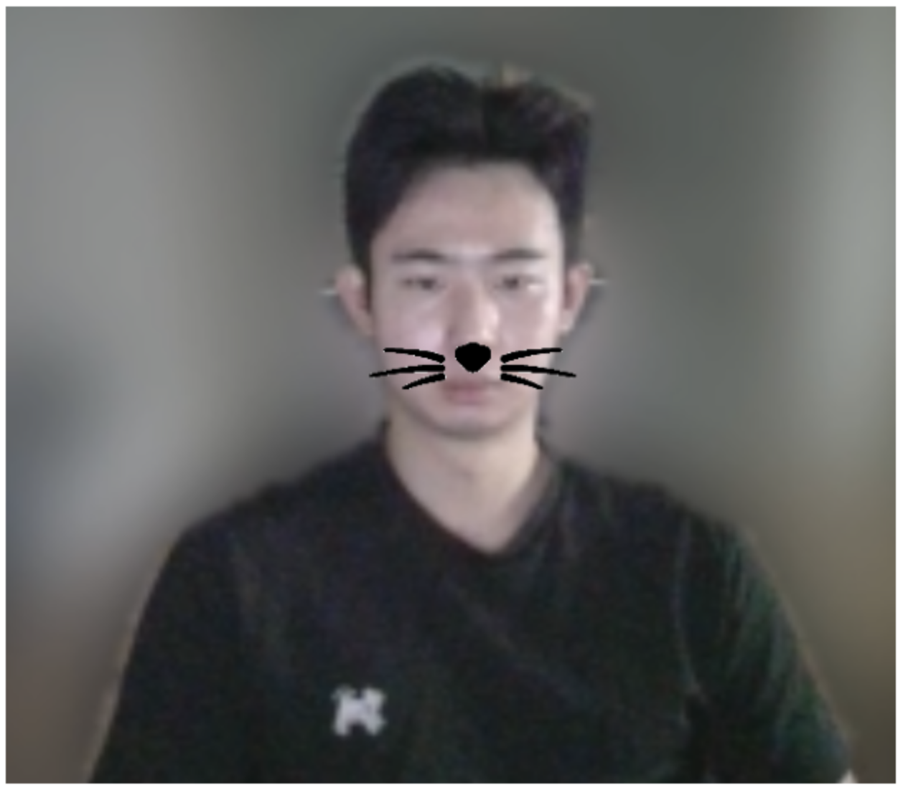
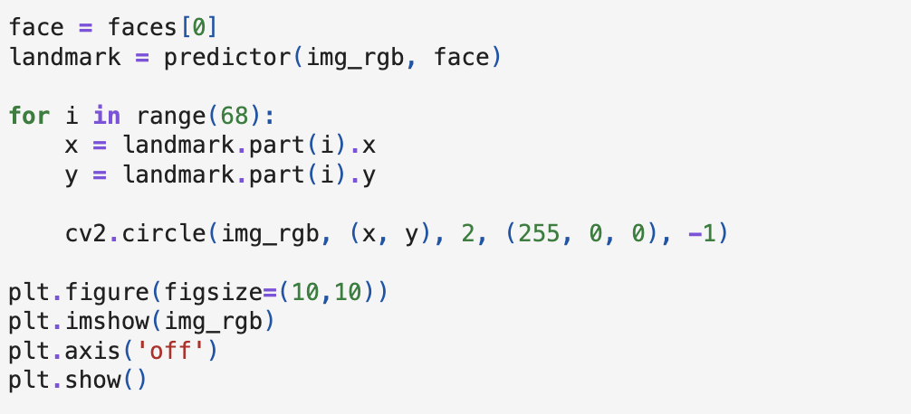
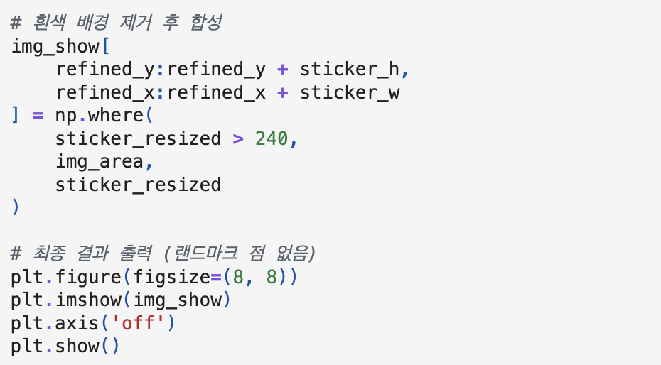
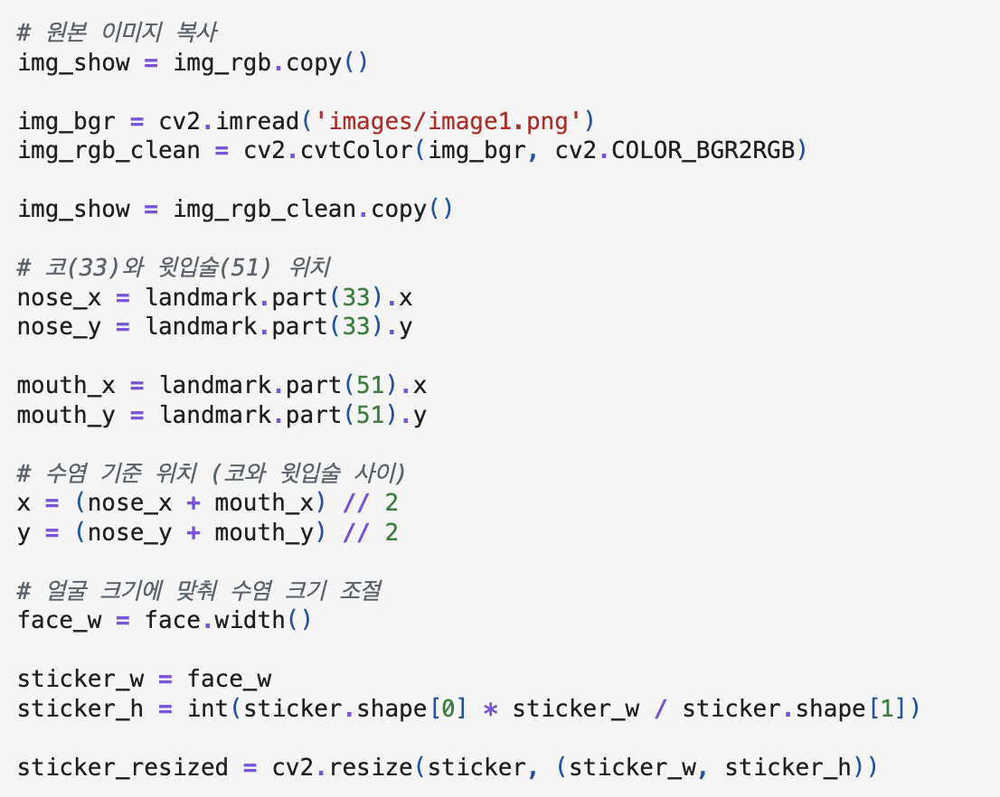
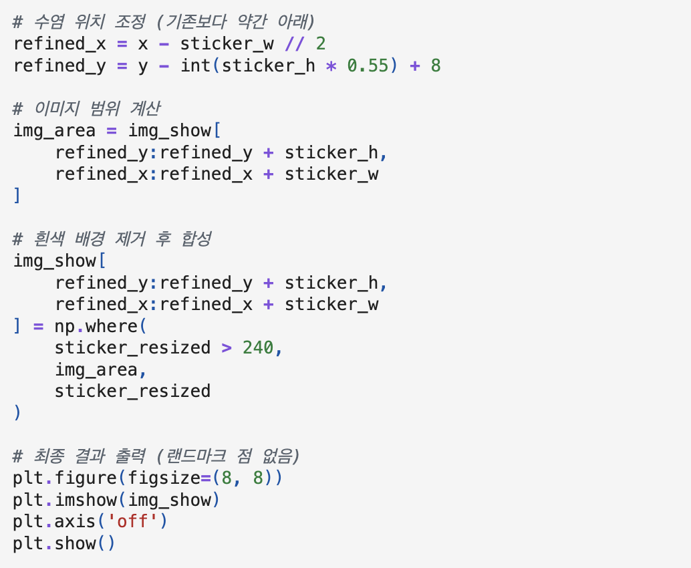
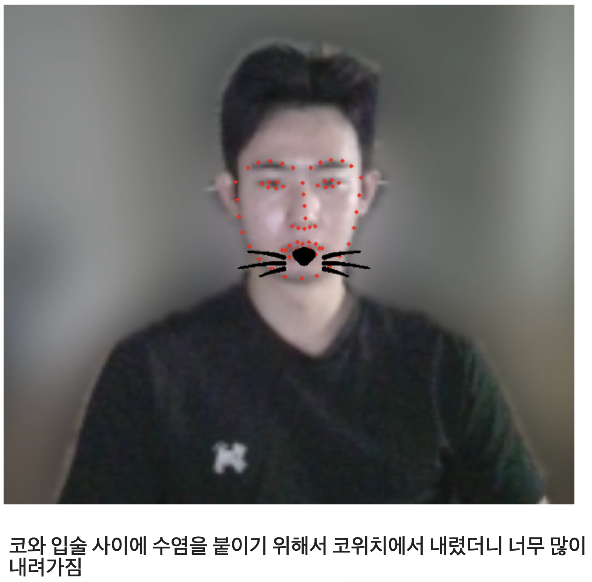
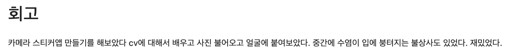
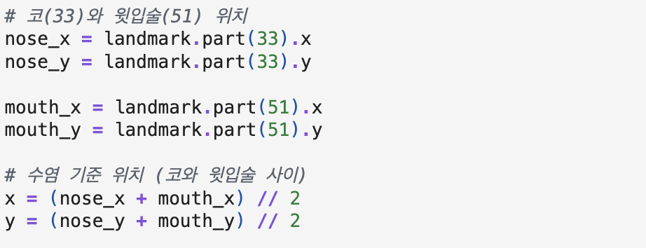

# AIFFEL Campus Online Code Peer Review Templete
- 코더 : 조현겸
- 리뷰어 : 이다겸


# PRT(Peer Review Template)
- [x]  **1. 주어진 문제를 해결하는 완성된 코드가 제출되었나요?**

  
  
수염이 위치해야 할 좌표를 계산하여 원본 얼굴에 잘 어울리도록 출력하였다. 

  
   
dlib의 get_frontal_face_detector()와 shape_predictor()를 활용하여 랜드마크를 정확히 검출하였으며,   
np.where()를 활용하여 스티커 사진의 흰생 배경을 제거한 후 합성하는데 성공하였다. 
    
- [x]  **2. 전체 코드에서 가장 핵심적이거나 가장 복잡하고 이해하기 어려운 부분에 작성된 
주석 또는 doc string을 보고 해당 코드가 잘 이해되었나요?**

전체 코드에서 가장 핵심적인 블럭은 수염 기준 위치를 찾고, 얼굴 위 수염의 좌표(y, x)값을 구한 후에 원본 이미지와 수염을 합성하는 블럭이다.  
 
  
주요 내용들과 해당 코드가 무엇을 의미하는지 상세하게 주석을 추가함으로써 코드를 접하는 사람이 쉽게 이해할 수 있게 하였다.   
        
- [x]  **3. 에러가 난 부분을 디버깅하여 문제를 해결한 기록을 남겼거나
새로운 시도 또는 추가 실험을 수행해봤나요?**

   
처음 스티커를 붙였을 때, 생각했던 것과 다른 위치에 고양이 수염 스티커가 붙었음을 기록하고, 이를 해결하기 위한 새로운 시도를 진행하였다.  
        
- [x]  **4. 회고를 잘 작성했나요?**

 
        
- [x]  **5. 코드가 간결하고 효율적인가요?**

   

```
변수명이 직관적이고, snake_case를 명확히 준수하여 파이썬 다운 코드를 작성하였습니다. 연산자 주변의 공백 배치가 적절하여 코드의 시각적 가독성이 높다.
또한 단순히 특정 픽셀 값을 더하고 빼서 위치를 맞춘것이 아니라, 랜드마크 33번과 51번의 중점을 구하는 식을 코드로 구현하여, 인물의 얼굴 크기가 바뀌더라도 코와 입술 사이의 비율을 유지하여 범용적 측면에서 매우 효율적이다. 
코드 블록 상단에 명확한 주석을 달아 코드를 직관적으로 이해할 수 있다. 
```

# 회고(참고 링크 및 코드 개선)
```
처음에는 단순히 코끝 랜드마크(33번)를 기준으로 스티커를 붙였다가 수염이 너무 내려앉는 현상을 겪으셨는데, 이를 그냥 넘기지 않고 코(33번)와 윗입술(51번)의 중간 좌표를 계산하여 수염의 중심을 잡은 점이 아주 훌륭합니다.
코드 블록마다 랜드마크 번호(33, 51)가 의미하는 바를 명시하고, refined_x, refined_y를 유도하는 과정을 주석으로 남겨놓아서 제3자가 코드를 읽고 이해하기 매우 쉽습니다.
```

[개선점 제안]
```
1) np.where 조건식의 경우, 현재 아래와 같은 조건을 사용하고 있습니다. 
np.where(sticker_resized > 240, img_area, sticker_resized)
이 경우 만약 고양이 수염 이미지 자체에 흰색이나 240이 넘는 밝은 색은 색이 포함되어 있다면 수염 안쪽까지 뚫려 투평하게 보일 위험이 있습니다. 
수염이 투명 배경을 지원하는 png 파일이므로, 이 경우 alpha 채널 마스크를 이용하는 것도 좋은 방법이 될 수 있습니다. 
아니면 지금처럼 투명 배경에 검정 단일 색상으로 입력된 이미지를 사용할 경우, 
stiker_resized==255를 사용하는 것도 좋은 방법이 될 수 있습니다. 

2) refiend_y 변수에는 다음과 같은 값이 할당되어 있습니다. 
refined_y = y - int(sticker_h * 0.55) + 8
+ 8 같은 픽셀은 현재 사진 속 얼굴 크기에 최적화 된 숫자이므로, 얼굴이 훨씬 크거나 작은 이미지가 들어오면 고양이 수염 스티커가 엉뚱한 위치에 갈 수 있습니다. 노드학습에서 이야기한 바와 같이, 이 고정픽셀값도 얼굴 크기에 비례하는 상대적인 비율로 바꾸는 것을 추천합니다. 

3) 현재 코드는 이미지에 얼굴이 딱 1개만 있다고 가정하고 face[0]을 바로 가져옵니다. 
만약 카메라에 얼굴이 인식되지 않거나(len(faces)==0인 경우 IndexError 발생), 한 사진에 여러명의 얼굴이 있을 경우 첫 번째로 입력된 face[0]에만 스티커나 붙습니다. 
얼굴이 인식죄디 않았을 때의 예외 처리를 추가하거나, for face in faces: 로 루프를 돌려 다중 얼굴 인식이 가능하게 한다면 완성도가 더 높아질 것 같습니다. 
```
